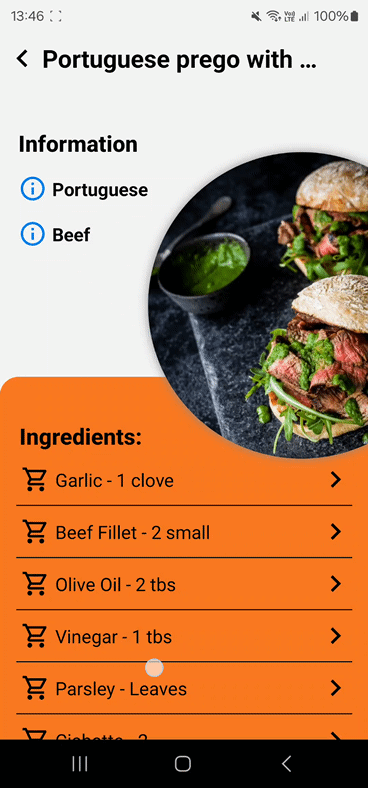

#  Foodder

Embark on a culinary adventure with Foodder, an innovative app that transforms food discovery into an engaging and personalized experience. Powered by the latest technologies, Foodder seamlessly blends Tinder-like swiping mechanics with a rich set of features to cater to every foodie's delight.

## ⭐️Features
### Main Screen 
- **Swipe to Discover:** Swipe through a curated selection of dishes, effortlessly discovering new favorites.
  
- **3D Card Flip Animation:** Experience a [3D card flip animation](#animations) to reveal a dish's detailed information.✨

- **Splash Screen Animation:** A fancy [3D animation](#animations) welcomes you when you first open the app.

### Favourite food list
- **Save Your Favorites:** Build your personalized wishlist by adding delectable dishes to your 'Liked' list.

- **Searching:** Use filters to search for specific types of food or sort your list by name or date added.

- **Swipe-to-Dismiss Removal:** Seamlessly remove dishes from your 'Liked' list with a simple [swipe to left action](#animations).

- **Undo Removal:** Easily recover accidentally removed dishes using the undo function.⏪

- **Pull-to-Refresh:** Refresh your 'Liked' list with a simple pull-down gesture, ensuring you're always up-to-date.

### Food details
- **[Dynamic Layout with Scrolling:](#animations)** As you scroll, an image and information of the dish animates scale and moving to the header of the screen. The image seamlessly adapts to different screen sizes and orientations, ensuring an optimal viewing experience.

- **Detailed Ingredients List:** Each ingredient can be clicked on to be directed to a web search.

- **Preparation Instruction:** Step-by-step instruction guiding users through the cooking process with ease.

## ⚙️Technologies
### 📱App:
- **Jetpack Compose:** Leverages Jetpack Compose's declarative UI toolkit to create a modern and responsive interface.🎨

- **Clean MVVM Architecture:** Separating the project into layers with repositories and uses cases, using view model functionalities.🔧

- **Room database:** SQLite ORM (Object-Relational Mapping) library to store the list of liked meals.

- **Retrofit2:** Used to fetch data from the API, including both categories and meals.

- **Dagger Hilt:** Used to inject dependencies throughout the app, including network clients, repositories, and use cases.

- **Coil:** Efficient image loading from various sources. 🖼️

- **Lottie:** Library for loading and displaying vector animations based on JSON files.

- **Material Designs:** Used to create the app's intuitive and visually appealing interface (scaffold, drop down menu, swipe to dismiss, snackbar, pull to refresh, card)

### ✅Testing:
- **JUnit4:** Utilized to write and execute unit tests.

- **Kotlin Coroutines Test:** Used to test asynchronous code that utilizes coroutines.

- **Truth:** Used to add more specific assertions in tests.

- **Hilt Android Testing:** Used to test app that use Dagger Hilt with use cases and repositories.

- **Compose UI testing:** Used to UI testing and end-to-end testing.

## Installation

1. Clone the repository:
```bash
git clone https://github.com/AdamDawi/Foodder
```
2. Open the project in Android Studio.
3. Be sure the versions in gradle are same as on github

## Here are some overview pictures:


## Animations:
 
   
 

## Requirements
Android 10 (API level 25) or later📱

## Author

Adam Dawidziuk🧑‍💻
